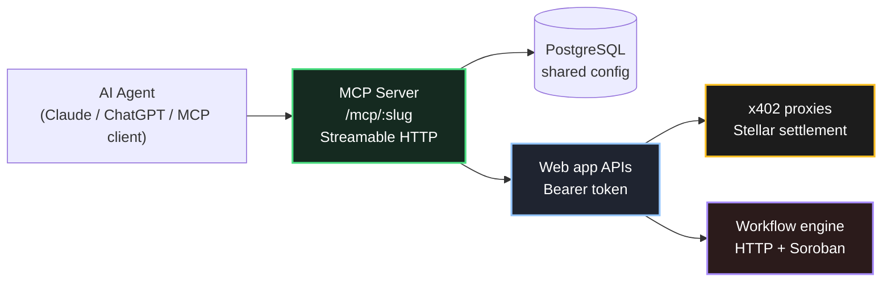

# Agent Loom

**Stellar-native agents with limits.**

Agent Loom is an agent execution fabric for **Stellar** and **Soroban**: paid HTTP APIs (x402-stellar), composable workflows, OAuth-scoped MCP servers, and optional on-chain steps—with clear custody and scope boundaries.

Agents integrate through **MCP** and **bearer tokens**; users connect with **Stellar wallet** auth where signing is required. The web app is the **OAuth authorization server**; the **MCP server** is a separate process that loads tool definitions from the same database.

---

## What Agent Loom Enables

- **x402-stellar API proxies** — metered, agent-callable HTTP with Stellar payment settlement
- **Workflow builder** — multi-step flows (HTTP, conditions, transforms, Soroban)
- **MCP servers** — slug-based endpoints (`/mcp/{slug}`) exposing proxies, workflows, and Stellar tools (e.g. Soroswap) to Claude, ChatGPT, and other MCP clients
- **User-signed Soroban** (default) — workflow contract calls via unsigned XDR → wallet sign → server submit; optional **hot wallet** for demos
- **OAuth 2.1** — tokens scoped for MCP (`mcp:tools`, `stellar:soroswap`, etc.)

---

## Why Agent Loom Exists

AI agents need to call **real APIs** and sometimes **on-chain** logic **without** turning every integration into full custodial server keys.

Agent Loom provides:

- **Economic primitives on Stellar** (x402) for paid steps
- **Composable workflows** with explicit step types and error handling
- **MCP as the agent-facing surface** with OAuth and slug-isolated servers
- A path toward **policy contracts** on Soroban (see `contracts/loom-session`) for relayer + rules.

It is the **Stellar counterpart** to the Agent Fabric idea on Cronos EVM: bounded surfaces for agents, not unbounded key access.

---

## Core Architecture

### 1. Web app (`apps/web`)

Next.js **App Router**: dashboard, proxies, workflows, MCP server configuration, **OAuth** (`/oauth/authorize`, `/api/oauth/token`, registration). Hosts user sessions (iron-session) and wallet-linked accounts.

### 2. x402 API proxies

Proxies validate payments, forward requests, and settle via Stellar x402 patterns (facilitator + legacy memo where configured).

### 3. Workflow engine (`packages/workflow`)

Definitions with steps: `http`, `condition`, `transform`, `soroban`, `soroban_batch`. **Live** runs support paid proxy steps (402 + payment evidence) and Soroban with **user** or **hot** signer.

### 4. MCP server (`apps/mcp-server`)

Express + **Streamable HTTP** MCP transport:

- **`POST /mcp/:slug`** — primary MCP traffic (session + JSON-RPC)
- **OAuth protected-resource metadata** per slug under `/.well-known` and `/mcp/:slug/.well-known/...`
- **`authorization_endpoint`** always points at the **web app** origin (`WEB_APP_URL` / `NEXT_PUBLIC_APP_URL`)
- **Requires `DATABASE_URL`** on the MCP process to load tools/workflows for each slug

### 5. Soroban contracts (`contracts/`)

Experimental **session policy** crate (`loom-session`): owner configures relayer + limits; relayer executes under checks. See [`contracts/README.md`](./contracts/README.md).

---

## End-to-End Flow (High Level)

1. Operator configures **proxies** and **workflows** in the dashboard.
2. Operator creates an **MCP server** with a **slug** and attaches tools/workflows.
3. **Vercel** runs the web app; **Render** (or similar) runs the MCP server with the **same** `DATABASE_URL`, `WEB_APP_URL`, and `MCP_PUBLIC_URL` / `NEXT_PUBLIC_MCP_URL` aligned.
4. User opens **OAuth** from the MCP client; approves scopes.
5. Agent calls **`{MCP_PUBLIC_URL}/mcp/{slug}`** with `Authorization: Bearer …`.
6. Tools invoke **web APIs** (with bearer) or **workflows**; paid steps use x402; Soroban steps use user or hot signing per step config.



---

## Monorepo Layout

| Path | Role |
|------|------|
| [`apps/web`](./apps/web) | Next.js dashboard, OAuth, proxies, workflows API |
| [`apps/mcp-server`](./apps/mcp-server) | MCP Streamable HTTP + tool registry |
| [`packages/database`](./packages/database) | Drizzle schema + Postgres client |
| [`packages/workflow`](./packages/workflow) | Workflow types, dry-run, live runner |
| [`contracts`](./contracts) | Soroban Rust workspace (policy MVP) |
| [`workers`](./workers) | Optional edge/worker utilities (e.g. trending tokens) |

---

## Quick Start (Local)

Prerequisites: **Node20+**, **pnpm**, **PostgreSQL**, **Redis** (if used), optional **Rust + Stellar CLI** for contracts.

```bash
cp .env.example .env
# Edit .env: DATABASE_URL, secrets, STELLAR_*, NEXT_PUBLIC_*, WEB_APP_URL, NEXT_PUBLIC_MCP_URL

pnpm install
# Push schema (from repo root or apps/web — follow apps/web README)
pnpm dev
```

- Web: `http://localhost:3000`
- MCP: `http://localhost:3001` (set `NEXT_PUBLIC_MCP_URL=http://localhost:3001` for correct dashboard connection URLs)

See **[`apps/web/README.md`](./apps/web/README.md)** and **[`apps/mcp-server/README.md`](./apps/mcp-server/README.md)** for env tables and commands.

---

## Production (Vercel + MCP host)

1. **Web (Vercel):** `DATABASE_URL`, `REDIS_URL`, session secrets, `NEXT_PUBLIC_APP_URL`, **`NEXT_PUBLIC_MCP_URL`** = public URL of MCP service (e.g. `https://your-mcp.onrender.com`).
2. **MCP (Render/Fly/etc.):** **`DATABASE_URL`** (same DB), **`WEB_APP_URL`** = Vercel origin, **`MCP_PUBLIC_URL`** = MCP service public URL, `PORT` if required.
3. Confirm MCP health: `GET {MCP_PUBLIC_URL}/health` → `"databaseConfigured": true`.
4. Connect clients to **`{MCP_PUBLIC_URL}/mcp/{slug}`**, not the Vercel origin.

For Claude Desktop / Cursor, the same **`mcp-remote`** pattern as Agent Fabric applies: `npx -y mcp-remote <full MCP URL>`.

---

## Built for Stellar

- **Networks:** Testnet / public via `STELLAR_NETWORK`, Horizon, Soroban RPC
- **Payments:** x402-stellar + facilitator; legacy memo 402 optional
- **Wallets:** Stellar Wallets Kit / Freighter patterns for signing.

---

## Use Cases

- Agent-callable paid APIs on Stellar
- Workflow automation with optional Soroban steps
- MCP discovery for trading, data, and internal tools (with OAuth scopes)
- Hackathon and production experiments toward **session policy contracts**

---

## License

MIT (unless otherwise noted in subpackages).

---

## Related

- **Agent Fabric** (Cronos EVM / x402 / session keys): separate codebase; Loom mirrors the *product shape* on Stellar.
- **Soroswap docs:** [docs.soroswap.finance](https://docs.soroswap.finance/)
- **Stellar MCP / OAuth:** protected-resource metadata is served from the MCP host; authorization UI lives on the web app.

### Source pointers

- [Web app & APIs](./apps/web)
- [MCP server](./apps/mcp-server)
- [Soroban contracts](./contracts)
